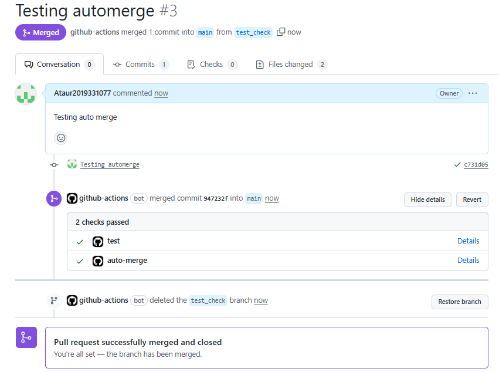

# 🚀 FastAPI CI/CD Auto-Merge Workflow

This project demonstrates how to set up an automated **CI/CD pipeline with GitHub Actions** that:

- Automatically runs tests for FastAPI when a pull request (PR) is submitted
- Only merges the PR if all tests pass
- Skips testing if the application is not present yet (`app/main.py` missing)
- Uses `gh` (GitHub CLI) to automatically merge the pull request
- Deletes the source branch after merge

---

## 📦 Project Structure
```
fastapi-autotesting/
├── app/
│ └── main.py # Your FastAPI app
├── tests/
│ └── test_api.py # Test client for API endpoints
├── .github/
│ └── workflows/
│ └── ci-automerge.yml # CI/CD workflow file

```

---

## ✅ Features

- Triggered on pull request events (`opened`, `synchronize`, `reopened`)
- Conditionally runs tests if `app/main.py` exists
- Auto-merges the PR using GitHub CLI if tests pass
- Deletes the source branch after successful merge

---

## ⚙️ Step-by-Step: GitHub Actions Explained

### 📁 Workflow File: `.github/workflows/ci-automerge.yml`

```yaml
name: FastAPI CI Test & Auto-Merge
```
- → This is the workflow name visible in the GitHub Actions tab.

### 🟡 Trigger Event
```yaml
on:
  pull_request:
    types: [opened, synchronize, reopened]
```
- → Trigger this workflow when a pull request is opened, updated, or reopened.


### 🧪 Job 1: test
```yaml
jobs:
  test:
    runs-on: ubuntu-latest
```
- → Runs this job in a Linux environment.

1. Checkout Repository
    ```yaml
    - name: Checkout code
    uses: actions/checkout@v4
    ```
    - → Checks out the current PR code so the workflow can access it.

2. Set Up Python
    ```yaml
    - name: Set up Python
    uses: actions/setup-python@v5
    with:
        python-version: "3.11"
    ```
    - → Installs Python 3.11.

3. Install Dependencies
    ```yaml
    - name: Install dependencies
    run: |
        pip install fastapi pytest httpx
    ```
    - → Installs FastAPI and testing tools.

4. Check If app/main.py Exists
    ```yaml
    - name: Check if app/main.py exists
    id: check_file
    run: |
        if [ -f "app/main.py" ]; then
        echo "file_exists=true" >> $GITHUB_OUTPUT
        else
        echo "file_exists=false" >> $GITHUB_OUTPUT
        fi
    ```
    - → This prevents the test job from failing when the FastAPI app isn’t added yet. Sets file_exists to true or false.

5. Run Tests Conditionally
    ```yaml
    - name: Run tests (only if main.py exists)
    if: steps.check_file.outputs.file_exists == 'true'
    run: |
        export PYTHONPATH=$PYTHONPATH:$(pwd)
        pytest tests/
    ```
    - → Only run pytest if main.py exists. Also sets PYTHONPATH so Python can find the app/ module.

### 🤖 Job 2: auto-merge
```yaml
  auto-merge:
    needs: test
    if: success()
```
- → This job only runs after test job finishes successfully.

1. Permissions to Merge
    ```yaml

        permissions:
        contents: write
        pull-requests: write
    ```
    - → Allows this job to push changes and modify PRs using GitHub CLI.

2. Install GitHub CLI
    ```yaml

    - name: Install GitHub CLI
    run: |
        sudo apt update
        sudo apt install gh -y
    ```
    - → Installs the GitHub CLI tool (gh) so we can programmatically merge PRs.

3. Authenticate the CLI
    ```yaml
    - name: Authenticate GitHub CLI
    run: |
        echo "${{ secrets.GITHUB_TOKEN }}" | gh auth login --with-token
    ```
    - → Logs in to GitHub CLI using the GITHUB_TOKEN secret (provided automatically by GitHub Actions).

4. Merge the Pull Request
    ```yaml
    - name: Merge the PR
    run: |
        gh pr merge ${{ github.event.pull_request.number }} \
        --squash --delete-branch --admin \
        --repo ${{ github.repository }}
    ```
    - → Merges the pull request automatically, deletes the source branch, and uses squash merge.

## 🔐 Recommended GitHub Settings
- Enable Auto-Merge (optional)
`Settings → Pull Requests → Enable "Allow auto-merge"`

- Protect the main branch
`Settings → Branches → Add Branch Protection Rule`

- ✅ Require status checks

- ✅ Disallow force pushes

- ✅ Require PR before merge

## 🧪 Example Test File (tests/test_api.py)
```python
from fastapi.testclient import TestClient
from app.main import app

client = TestClient(app)

def test_root():
    response = client.get("/")
    assert response.status_code == 200
    assert response.json() == {"message": "Welcome to FastAPI"}
```
## 🚀 How It Works
- Developer submits a pull request.

- GitHub Actions runs all tests.

- If tests fail → GitHub blocks merge and shows error.

- If tests pass → GitHub CLI merges the PR automatically.

- The source branch is deleted.

## Preview(when tests pass)
